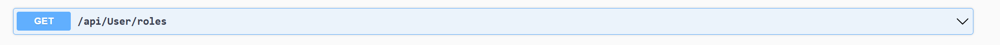
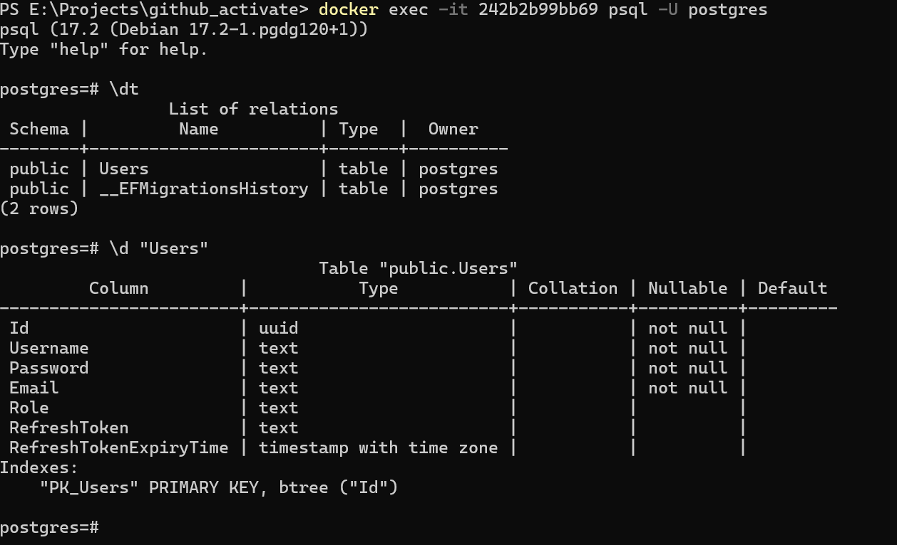
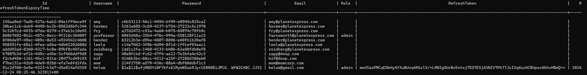

# Activate's Interview Project Readme

Welcome to Activate's Interview Project. This repository provides a foundational template for a modern full-stack application, offering essential functionality to demonstrate best practices and key concepts. Below, you'll find an overview of the project's features, architecture, and instructions for running the application.

Please note, this is used during our interview process and not intended to be used in production.

The tasks for this interview can be found at the bottom of this README. We value your time, and we thank you for taking part in our interview process. As such, we don't expect you to spend a lot of time on this. You don't have to complete all of the tasks. Just do what you feel is right, and represents you best as a software engineer.

We have made this project as an open source template, with no restrictions on license. At the very least, you can use it as a great starting point for your next awesome project, or add it to your developer portfolio. 

---

## **Project Overview**

### **Scope and Features**

This project serves as a starting point for building scalable and maintainable applications. It includes:

- **User Management**: User registration and login functionality.
- **Authentication**: Secure JWT token-based authentication with http-only cookies for persistence.
- **CRUD Operations**: Sample Create, Read, Update, Delete operations.
- **Frontend Framework**: React with routing and state management.
- **Styling**: Material UI (MUI) integrated with a theme provider.
- **Form Handling**: React Hook Form (RHF) with validation.
- **State Management**: Redux Toolkit with local storage integration.
- **Testing**: Examples using React Testing Library (RTL), Moq, and MSTest Framework.
- **Backend Architecture**: .NET Core backend with Unit of Work and Repository patterns.
  
### **Technologies Used**

- **Frontend**: React, Redux Toolkit, React Hook Form, MUI.
- **Backend**: .NET Core with EF Core, Unit of Work, and Repository patterns.
- **Database**: PostgreSQL.
- **Testing**: React Testing Library, MSTest Framework, Moq.
- **Containerization**: Docker with multi-profile support.

This template demonstrates best practices for secure user authentication, clean architecture, and test-driven development.

---

## **Setup and Usage**

### **Docker Profiles**

This project supports two Docker profiles to accommodate different use cases:

1. **`dev`**: Runs a PostgreSQL database only. The frontend and backend must be run manually for development purposes.
2. **`docker`**: Runs all components, including the database, frontend, and backend.

---

### **Initial Setup**

#### **1. Database Migration**
Before running the application, the PostgreSQL database must be initialized with the required schema:

1. Start the `dev` Docker profile:
   ```bash
   docker compose --profile dev up
   ```
2. The database migrations will be applied on startup, so no additional work should be needed to provision the database.

---

### **Running the Application**

#### **For Demo**

1. Stop any running `dev` Docker containers:
   ```bash
   docker compose down
   ```
2. Start the `docker` profile:
   ```bash
   docker compose --profile docker up
   ```
3. Access the frontend at [http://localhost:8080](http://localhost:8080).
4. Register a user and log in with your credentials.

---

#### **For Development**

1. After migrating the database, install dependencies for the React app:
   ```bash
   cd react-app
   npm install
   ```
2. Start the React development server:
   ```bash
   npm run start
   ```
3. Open the .NET solution in Visual Studio, build, and run the backend.
4. Access the frontend at [http://localhost:3000](http://localhost:3000).

---

## **Testing**

The project includes testing examples to ensure reliability:

- **Frontend**: React Testing Library (RTL) for UI testing.
- **Backend**: MSTest Framework and Moq for backend logic validation.

Run tests using the respective tools (e.g., `npm test` for React, Visual Studio Test Explorer for backend tests).

---

## **Additional Notes**

- Ensure Docker, Node.js, and .NET 8 SDK are installed on your system.
- Update environment variables as needed for development or production configurations.
- Feel free to extend or customize the project to fit specific requirements.

---

By following the steps above, you should have the project running successfully for either demo or development purposes. If you encounter issues or have questions, feel free to raise them in the repository's issue tracker.

---

# Activate's Interview Project Tasks

Welcome to Activate's interview project! This project is designed to give you the flexibility to work on the tasks at your own pace. Just let us know when you're ready to submit your work. You can send me a link to your own repository, perhaps with waiting pull requests or simply so I can look through your past commits.

We’ve structured this project around real-world examples because we’re interested in more than just your coding skills. We want to understand how you approach architecture, problem-solving, and critical thinking.

As you work on these tasks, please follow standard development practices and workflows. Commit your work as you would in a professional environment.

## **Tasks**

### **ACVT001**
Fix the currently failing GetAllUsers_ReturnsListOfUsers test.
- Assert.AreEqual failed. Expected:<Activate.InterviewProject.Core.Models.AppUser (Activate.InterviewProject.Core.Models.AppUser)>. Actual:<Activate.InterviewProject.Core.Models.User (Activate.InterviewProject.Core.Models.User)>

### **ACVT002**
When I log into the app, and I can see the table of users, there is a browser console error: 
- "Each child in a list should have a unique "key" prop." 

Fix the console error.

### **ACVT003**
Fix an issue occuring on smaller mobile devices, where users cannot see the edit and delete buttons in the users table.

### **ACVT004**
When I edit a user's details, I can easily pick their "Account type" from the dropdown. That data is currently hard coded on the frontend. Extend the application so that the list of account types is pulled from the database, vs hard coded on the front end.

### **ACVT005**
Fix an issue where the table shown on the normal users tab does not show all of the non-admin users. 


--------------------------------------------------------------------------

##  My comments about Tasks

ACVT001

The issue in the test arises because the Assert.AreEqual statement is trying to compare two different types of AppUser (from the mocked data) and User (the result of the Map method).
 So had to take following actions
*  Object property arrangement changed
*  Get all users as a list
*  Verify admin and user, each property
*  To maintain proper naming conventions, GetAllUsers_ReturnsListOfUsers changed as GetAllUsers_ReturnsListOfUsers_Verify

ACVT002

The console error encountered is because React requires that each child in a list have a unique key prop to help it identify which items have changed, are added, or are removed. In current code, neither the <TableCell> inside cols.map nor the <UserRow> component has a key prop.

ACVT003

Previously its not enabled horizontal scrolling for smaller devices and items scattered around each other in the table to solve that, in index.css file its able to add following css changes
overflowX: 'auto': Wrapping the table with a scrollable container ensures that horizontal scrolling is available when the table overflows the viewport width.
white-space: nowrap: Prevents table cell contents (like long email addresses or action buttons) from wrapping to the next line, which could break the layout.

ACVT004

Hardcoding is not an ideal approach for retrieving roles in this application, it would be better to create a new table to store roles so it can accommodate upcoming CRUD operations for it. Currently due to time limitation I have retrieved the roles from existing user list service.
For backend changes Added new method as Task<IEnumerable<UserRoles>> GetAllUserRoles()
In order to generate a list of UserRoles objects, this method uses _unitOfWork.Users.GetAll() to retrieve all users from a data source and process their roles. It maps the role of each user so that, if the role is "admin," it is labelled "Administrator"; if the role is null or any other value, "User" is the default. 

API to accommodate new roles

 

Unit test added as  GetAllUserRoles_ReturnsCorrectRoles() 
For the Frontend it has to change EditUserDialog.tsx and EditForm.tsx 
asynchronously fetches user roles from the API endpoint "user/roles" using Axios, useEffect hook that trigger when selectedUser changes. dropdown form field integrated with React Hook Form, dynamically populating options from a roles array.

*Future Improvements*

Current table structure like following

 

 

So, to facilitate data integrity and duplicate data, it’s better to introduce new table as Role

Role Table Schema - Id (string), Value (string), Name (string)

| Id                       | Value  | Name          |
|--------------------------|--------|---------------|
| 28f18cf4-65fa-44e9       | admin  | Administrator |
| f3237b45-3cd2-4b52       | user   | User          |


ACVT005

Intiallay posgresql query updated as SELECT * FROM ""Users"" u WHERE u.""Role"" <> 'admin' OR u.""Role"" IS NULL to get null records, since it’s not retrieving with previous method
handleUserUpdate method added to triggers the refetch for all user data when a user is edited or updated.


------------------------------------------------------------
### Enhancements & Suggestions 

1. Applying in memory caching would be ideal going forward.

2. Exception handling and logs mechanism to identify issues will be beneficial.

3. with current design, it can achieve same outcome by changing the Role varchar column as IsAdmin boolean column since current usage it just keeping admin or user user roles, but going forward it may need to expand to broader design (ex: there can me another super user)
currently even normal users can see other users, but rightfully it should be restricted, only for admin users can view normal users and edit other users.

4. better to maintain new RolesService and Roles Controller, Roles Repository to in the mind of adhere to SOLID principles.


